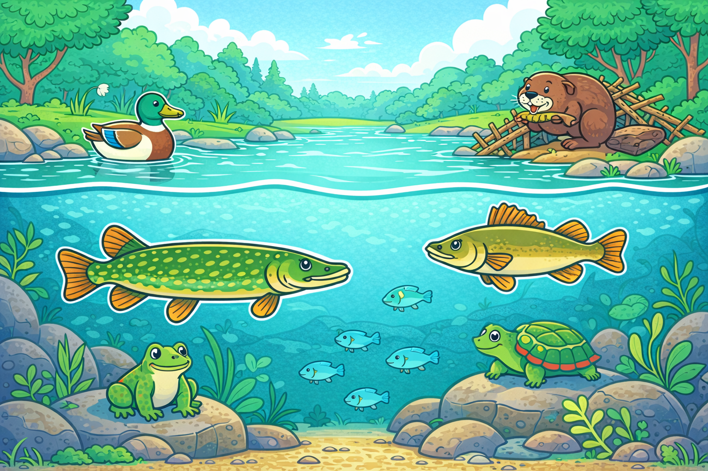

# Ecosystem Discovery Application 🌿🐟

  

> A web-based interactive educational application designed to help elementary school students explore a Saskatchewan-inspired freshwater ecosystem through discovery-based learning and engagement.

---

## Project Overvie

The Ecosystem Discovery Application is developed as part of ENSE 281 – Software Engineering Management at the University of Regina.

The system is designed for Grade 3 learners and introduces freshwater ecosystems through a visual and interactive environment. Users explore an ecosystem scene, discover animals, unlock stickers, and learn ecological concepts in an engaging way.

---

## Course Information

- Course: ENSE 281 – Software Engineering Management  
- Instructor: Dr. Tim Maciag  
- Project: Ecosystem Discovery Application  
- Team: Group G  

---

## Team Members

- Rayansh Chowatia  
- Jeremiah Onunkwo  
- Abrianna Primavera  
- Aubin Chriss Izere  

---

## Problem Definition

Traditional learning methods rely on static diagrams and text-heavy content, which can make it difficult for younger students to understand ecosystems and environmental relationships.

This project addresses that gap by providing an interactive digital experience that allows students to explore ecosystems visually and learn through discovery.

---

## Core Learning Experience

The application follows this interaction flow:

1. User opens the application  
2. User enters the ecosystem scene  
3. User clicks on an animal  
4. The system displays educational information  
5. A sticker is unlocked  
6. Progress is updated  
7. The user continues exploration  

---

## Scope Summary

### In Scope
- Saskatchewan freshwater ecosystem  
- 6–8 interactive animals  
- Information pop-up cards  
- Sticker collection system  
- Progress tracking  
- MVC-based system design  

### Out of Scope
- Multiplayer features  
- User authentication  
- Multiple ecosystems  
- Advanced scoring systems  
- Complex simulations  

---

## Minimum Viable Product (MVP)

- Interactive ecosystem scene  
- Clickable animal discovery  
- Educational content display  
- Sticker reward system  
- Progress tracking  
- Structured data model  

---

## System Architecture

The system follows the Model–View–Controller (MVC) architecture:

- Model: Manages animal data and progress  
- View: Displays UI and ecosystem interactions  
- Controller: Handles user actions and updates  

---

## Prototype (Figma)

https://www.figma.com/design/TSUWRBOK4Zgi3H7ILobe8K/ENSE-281-%E2%80%93-Ecosystem-Discovery-%E2%80%93-HiFi-Prototype

---

## GitHub Project Boards

Project Management Board:  
https://github.com/users/Rayansh-Chowatia/projects/2  

Development Tasks Board:  
https://github.com/users/Rayansh-Chowatia/projects/1  

---

## Project Initialization Deliverables

- [Business Case](Project_Initialization/Documents/Business%20Case/Business_Case_GroupG_EcosystemApp.pdf)  
- [Charter Document](Project_Initialization/Documents/Charter%20Document/Charter_Document_GroupG_EcosystemApp.pdf)  
- [Pitch Deck](Project_Initialization/Documents/Pitch%20Deck%20Report/Pitch_Deck_GroupG_EcosystemApp_Activity1.pdf)  

---

## Project Planning and System Design Deliverables

### Project Documents
- [Project Requirements](Project_Planning_and_System_Design/Documents/Project_Requirements/Project_Requirements_Document_GroupG_EcosystemApp_Activity2.pdf)  
- [Project Scope](Project_Planning_and_System_Design/Documents/Project_Scope/Project_Scope_GroupG_EcosystemApp_Activity2.pdf)  
- [Stakeholder Register](Project_Planning_and_System_Design/Documents/Project_Stakeholder_Register/Project_Stakeholder_Register_GroupG_EcosystemApp_Activity2.pdf)  
- [Stakeholder Engagement Plan](Project_Planning_and_System_Design/Documents/Stakeholder_Engagement_Plan/StakeholderEngagementPlan_GroupG_EcosystemApp_Activity2.pdf)  
- [Roles and Responsibilities](Project_Planning_and_System_Design/Documents/Project_Roles_and_Responsibilities/Project_Roles_and_Responsibilities_GroupG_EcosystemApp_Activity2.pdf)  
- [MVP Definition](Project_Planning_and_System_Design/Documents/MVP/MVP_GroupG_EcosystemApp_Activity2.pdf)  
- [RBAC](Project_Planning_and_System_Design/Documents/RBAC/RBAC_GroupG_EcosystemApp_Activity2.pdf)  

### UML Diagrams
- [Class Diagram](Project_Planning_and_System_Design/UML_Diagrams/Class_Diagram/Class_Diagram_GroupG_EcosystemApp_Activity2.pdf)  
- [Data Flow Diagram](Project_Planning_and_System_Design/UML_Diagrams/Dataflow_Diagram/DataFlow_Diagram_GroupG_EcosystemApp_Activity2.pdf)  
- [Use Case Diagram](Project_Planning_and_System_Design/UML_Diagrams/UseCase_Diagram/UseCase_Diagram_GroupG_EcosystemApp_Activity2.pdf)  
- [MVC Architecture](Project_Planning_and_System_Design/UML_Diagrams/MVC_Architecture_Diagram/MVC_Architecture_Diagram_GroupG_EcosystemApp_Activity2.pdf)  

### Design
- [Low Fidelity Prototype](Project_Planning_and_System_Design/Design/Low_Fidelity/Lo_Fidelity_GroupG_EcosystemApp_Activity2.pdf)  
- [High Fidelity Prototype](Project_Planning_and_System_Design/Design/High_Fidelity/High_Fidelity_GroupG_EcosystemApp_Activity2.pdf)  

### Scrum & Evaluation
- [Scrum Report](Project_Planning_and_System_Design/Scrum_Report/Scrum_Report_GroupG_Ecosystem_Activity2.pdf)  
- [User Questionnaire](Project_Planning_and_System_Design/Evaluation/User_Questionnaire_EcosystemApp_Activity2.pdf)  

---

## Final Remark

This repository documents the planning and design phases of the Ecosystem Discovery Application and demonstrates structured software engineering practices including requirements analysis, system design, prototyping, and Agile project management.
